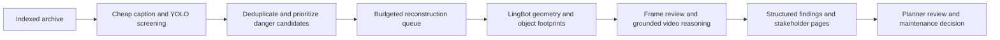

# Commercial production workflow

The implemented MVP is **interactive screening and selective reconstruction**. The archive-wide batch runner described here is a production design, not an implemented scheduler.

1. **Scan the existing index incrementally.** Use canonical parent IDs, camera/location, capture times where available and a durable cursor. Run cheap caption/embedding queries and detection context for cyclist avoidance, impact/fall candidates, obstructed riding paths and screened crossings. Do not treat the top 100 interactive hits as exhaustive archive coverage.
2. **Deduplicate and prioritize.** Merge overlapping segment hits by parent and approach; retain every matched interval and screening rationale. Prioritize observed contact/avoidance or repeated obstruction for human triage. A model match is a candidate, not a verified incident. Measure false positives and false negatives with sampled negative footage, camera coverage and labeled reviews.
3. **Apply compute budgets.** Limit parents per camera/day, GPU hours, retries, transfer size and concurrency. Use cheap screening to narrow the corpus before running expensive geometry/detection/frame review. Add distributed leases and conditional updates before scaling beyond this MVP's singleton coordinator.
4. **Reconstruct exact indexed bytes.** Preserve full parent context, source checksum, camera/scene calibration assumptions, service/model/prompt versions, frame sampling and every archive interval. Avoid filenames as sole identity. Detect poor reconstruction, missing assets and sparse approaches; route those to limited-result review.
5. **Analyze actual constraints.** Combine video-observed avoidance with spatial obstruction and motion confidence. Admit a bottleneck only when its operational consequence is supported. Aggregate standing footprints alone cannot quantify congestion. Traffic-flow interventions need temporal tracks, road geometry, calibrated scale and observed passage/queue effects beyond the current saved footprint model.
6. **Review and generate structured actions.** Keep geometry claims, independent frame confirmations/rejections and caption observations separate. Produce JSON action, severity, metrics and segment references. Carry disagreements forward. Do not make legal, collision-causality or measured-benefit claims from this prototype's estimates.
7. **Publish stakeholder pages after review.** Present the reconstructed approach, highlighted objects, action and concise evidence tabs. Require planner approval before maintenance/enforcement decisions. Save immutable versions so any recommendation can be traced to the source, models and exact analyzed frames.
8. **Operate and evaluate.** Track coverage, candidate yield, reconstruction failures, unsupported/rejected findings, human overrides, compute cost and intervention follow-up. Add authenticated per-tenant/camera access, rate limits, retention/deletion rules for footage and exports, monitoring and retry dead-letter queues. Maintain cached stakeholder pages during tunnel/GPU outages.

This VM implementation establishes the source-transfer, durable-job, verified-artifact, structured-action and stakeholder-page contracts. A future live-video input page can feed the same contracts after an authorized ingestion policy is defined. Current scope remains the existing indexed archive.
